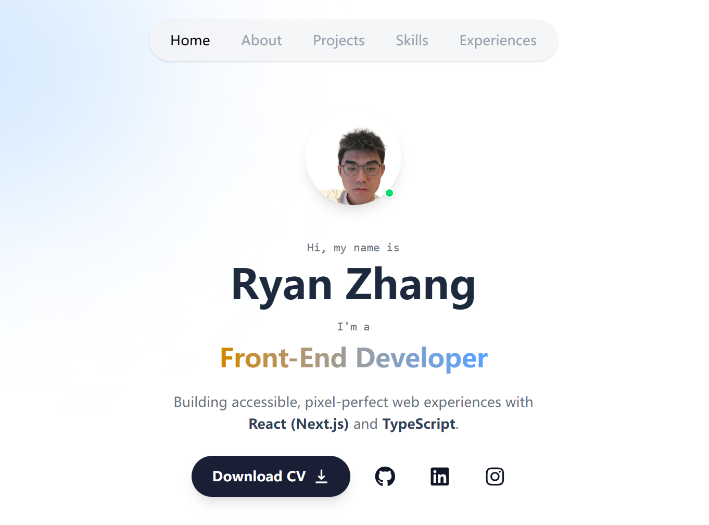

# My Portfolio



My personal portfolio website. I started with ByteGrad's project as a base, then updated the tech stack and fixed a few things to make it my own.

Built with **Next.js 16**, **React 19**, **TypeScript**, **Tailwind CSS**, and **Framer Motion**.

## What I Changed

Here are the main differences from the original tutorial:

- **Fixed the Scroll Bug**: Solved the issue where the navbar covered section titles when clicking links.
- **Tech Stack Upgrade**: Bumped everything to the latest versions (Next.js 16 & React 19).
- **UI Tweaks**: Redesigned the "Intro" and "Projects" sections to look cleaner.
- **Better Animations**: Added more smooth interactions using Framer Motion.
- **Coming Soon**: Planning to add sound effects and better navigation cues.

## Stack

- **Framework**: Next.js 16 (App Router)
- **Library**: React 19
- **Language**: TypeScript
- **Styling**: Tailwind CSS
- **Animation**: Framer Motion
- **Deployment**: Vercel

## Run Locally

1. Clone the repository:
   ```bash
   git clone https://github.com/LuvsicptZ/my-portfolio.git
   ```

2. Install dependencies:
   ```bash
   npm install
   ```

3. Start the development server:
   ```bash
   npm run dev
   ```

4. Open [http://localhost:3000](http://localhost:3000) to view it in the browser.

## Customize

All personal data (projects, skills, experiences) is in `lib/data.ts`. You can just edit that file to update the content.

## Structure

```
app/           → App Router pages and layouts
components/    → Reusable UI components (Bio, About, Projects, etc.)
context/       → React Context (Active Section State)
lib/           → Data, types, and utility hooks
public/        → Static assets (images, icons)
```

## License

MIT
